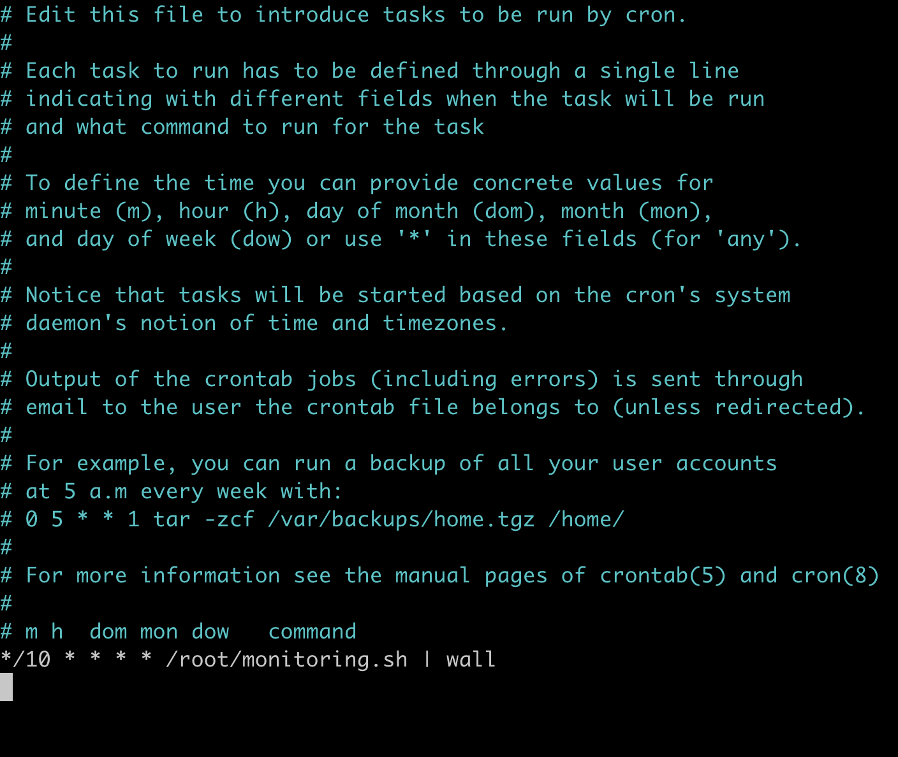

# **Born2beRoot**

_요약: VirtualBox를 이용해 운영체제를 설치해보는 프로젝트 입니다._

# **Contents**

- [**Born2beRoot**](#born2beroot)
- [**Contents**](#contents)
- [**Mandatory part**](#mandatory-part)
	- [**Project overview**](#project-overview)
	- [**Simple setup**](#simple-setup)
	- [**User**](#user)
	- [**SUDO**](#sudo)
	- [**UFW**](#ufw)
	- [**SSH**](#ssh)
	- [**Script monitoring**](#script-monitoring)
- [**Bonus**](#bonus)

[과제 수행 참고 사이트]

* [setting 참고 사이트](https://velog.io/@appti/born2beroot-Virtualbox-Debian-설치)

* [mandatory - bonus 참고 사이트](https://velog.io/@augus-xury/가상머신Debian-세팅하기#php-설치)

# **Mandatory part**

## **Project overview**


### **✅ Virtual box 설명하기**

_가상머신(VM)_

운영체제를 여러개 돌릴 수 있게하는 것으로, 물리적 컴퓨터의 디지털 버전입니다.

```.vim
host : 물리적 컴퓨터
guest : VM으로 만든 컴퓨터
```

어떠한 운영체제라도 설치할 수 있게 하는 소프트웨어를 말합니다.

기존의 하드웨어 위에 OS가 위치하는 것이 아닌,

일반적으로 하드웨어 위에 vmm을 올리고 그위에 여러개의 OS가 올라간 형태를 가집니다.

호스트 하드웨어에 영향을 주지 않으며 게스트 환경의 것을 게스트 밖으로 내보낼 수 없습니다.

새로운 애플리케이션 테스트나, 악성 코드 분석 등의 목적으로 사용이 가능합니다.

_하이퍼바이저_

하이퍼바이저는 가상머신을 생성하고 구동하는 소프트웨어입니다.

가상머신 모니터(VMM)라고도 불리며 하이퍼바이저 운영체제와 가상머신의 리소스를 분리해 VM의 생성과 관리를 지원합니다.

-   하이퍼바이저의 유형

		하이퍼바이저는 타입 1과 타입 2로 나뉩니다.

		`타입 1`의 경우 네이티브(Native) 혹은 베어메탈(Bare Metal) 하이퍼바이저라고도 불리며,

		하드웨어와 직접 상호작용 합니다.

		KVM/QEMU, XEN 등이 타입 1 하이퍼바이저에 속합니다.

		반면 `타입 2`는 호스트 운영체제 위에서 하이퍼바이저가 동작합니다.

		따라서 타입 2를 호스티드(Hosted) 하이퍼바이저라고 부르기도 합니다.

		VMware Fusion, VMware Workstation, Parallels Workstation, VirtualBox 등이 있습니다.

		해당 과제에서는 `타입 2`의 `VirtualBox`를 활용합니다.

		[버추얼 박스 설치 공식 링크](https://www.virtualbox.org/wiki/Downloads)


<div align = "right">
	<b><a href = "#Contents">↥ top</a></b>
</div>


### **✅ 선택한 os = Debian**

_무료 오픈 소스 소프트웨어로 만든 운영체제입니다_

온라인 커뮤니티에서 제작된 컴퓨터 운영체제입니다.

사용법이 온라인 웹사이트나 커뮤니티에 자세히 기술되어 있다는 점이 진입장벽을 낮추어 초보 리눅스유저들이 접근하기 쉬운 OS입니다.

* Linux

	```.vim
	리눅스(Linux)는 리누스 토르발스가 커뮤니티 주체로 개발한 컴퓨터 운영 체제입니다.

	리눅스(Linux)는 UNIX운영체제를 기반으로 만들어진 운영체제 입니다.

	두가지 계열의 리눅스가 있는데,바로 레드햇계열과 데비안계열입니다.

	대표적인 버전으로 레드햇의 센토스OS 데비안의 우분투OS가 있습니다.
	```

* cf) centOS

	_Community Enterprise Operating System_

	센트OS(영어: CentOS)는 센트OS 프로젝트에서 레드햇 제휴로 개발한 컴퓨터 운영체제입니다

	서버용으로 리눅스를 운영할 목적으로 대부분 쓰이고 있습니다.

<div align = "right">
	<b><a href = "#Contents">↥ top</a></b>
</div>

###  **✅ APT and aptitude 설명하기**

_패키지관리 프로그램의 한 유형입니다_

* 패키지?

	커널 및 라이브러리 버전의 배포판 환경에 맞추어 빌드한 실행파일을 압축한 것입니다.

	데비안 패키지 방식은 메인테이너들에 의해서 패키지가 관리되고 있어서 패키지를 네트워크를 통해 다운받을 때 의존성 패키지가 있는지를 검사하고 의존성 패키지가 자신의 환경에 설치되어 있지 않다면 자동으로 의존성 패키지까지 같이 설치할 수 있도록 지원하고 있습니다

* apt

	_Advanced Packaging Tool_

	데비안 GNU/리눅스 배포판 계열 배포판에서 소프트웨어를 설치하고 제거하는 일을 합니다.

	APT는 이진 파일로부터나 소스 코드 컴파일을 통하여 소프트웨어 패키지의 확인·구성·설치를 자동화함으로써 유닉스 계열 컴퓨터 시스템 상의 소프트웨어를 관리하는 작업을 단순하게 만든다.

* aptitude

	APT의 프론트엔드 프로그램입니다.

	앱티튜드는 소프트웨어 패키지의 목록을 보여주고, 사용자가 패키지를 능동적으로 설치 혹은 삭제하도록 허용한다.

	특히 유연한 검색 패턴을 지원하는 검색 기능을 가지고 있습니다.

	```.vim
	위 둘의 가장 큰 차이는 프론트엔드 지원 유/무 입니다.
	```

<div align = "right">
	<b><a href = "#Contents">↥ top</a></b>
</div>

###  **✅ script 정보 5분마다 보이기**



Sudo crontab -l

// list

Sudo crontab -e

// edit


_[script에서 설명](#Script-monitoring)_

<div align = "right">
	<b><a href = "#Contents">↥ top</a></b>
</div>

-----

## **Simple setup**


### ✅ Check UFW service

sudo ufw status numbered

### ✅ Check SSH service

systemctl status ssh

//openserver 실행 중인지 여부 확인

ss -tunpl

//정보 확인

### ✅ Check Debian

hostnamectl

//정보 확인

<div align = "right">
	<b><a href = "#Contents">↥ top</a></b>
</div>

-----

## **User**


### ✅ Check belongs to the sudo, user42 groups

cat /etc/group

or

id ejachoi

### ✅ 과제에서 부과된 passwd policy 적용 여부 확인하기

chage -l ejachoi

sudo vi /etc/shadow

sudo visudo

[visudo의 내용은 아래에서 다루고 있습니다](#과제에서-부여한-룰)

### ✅ new user 만들고

`id ejachoi`

: ejachoi user가 속하는 그룹 확인

`adduser [newuser]`

: user 생성

- `useradd [newuser]`

	: 계정만 생성됨. 디렉토리 등등은 별도로 설정 필요

`passwd [newuser]`

: newuser의 비밀번호 설정

`addgroup [newgroup]`

: group 생성

`usermod -G [newgroup] [newuser]`

: newuser를 newgroup에 배정

`userdel -f [user]`

: 강제삭제

<div align = "right">
	<b><a href = "#Contents">↥ top</a></b>
</div>

-----

## **SUDO**
_임시 root 권한으로, 현재 계정에서 root 권한을 빌려서 명령어를 실행합니다_


### ✅ sudo 설치 여부 확인하기

	```vim
	$ dpkg -l sudo
	```
	_dpkg = package manager for Debian_

<div align = "right">
	<b><a href = "#Contents">↥ top</a></b>
</div>

### ✅ sudo 그룹에 새 사용자를 할당하기

	```vim
	$ id [name]
	// user가 속하는 그룹 확인

	$ adduser [newuser]
	// user 생성

	$ passwd [newuser]
	// newuser의 비밀번호 설정

	$ addgroup [newgroup]
	// group 생성

	✅ $ usermod -G [newgroup] [newuser]
	// newuser를 newgroup에 배정

	$ userdel -f [user]
	// 강제삭제
	```
-	G 옵션

	G옵션만 붙힌 상태에서 그룹 설정 시, gid그룹을을 제외하고 명령어에 나열된 그룹만 추가가 되며 명령어에 나열되어 있지 않지만 유저가 속해있는 그룹은 전부 탈퇴됩니다.

-	a 옵션:

	G옵션에서만 함께 쓰일 수 있고, 유저가 속해있지만 명령어에 나열되어있지 않는 그룹에 관하여 탈퇴처리 되지 않습니다.

<div align = "right">
	<b><a href = "#Contents">↥ top</a></b>
</div>

### ✅ 과제에서 부과한 엄격한 룰을 보이며 sudo의 가치와 작동을 설명하기

현재 사용자의 비밀번호 필요합니다.
```vim
sudo [command]
```
_root 권한으로 command 실행_

즉, 하나의 명령에 대해 일시적으로 root 권한을 사용합니다.

* **root**

	_유닉스 계열의 운영체제에서 모든 제어권한을 가지고 있는 최고관리자의 ID 혹은 관리자 그 자체를 말합니다_

	'#' 프롬프트 (일반 사용자는 '$'('%') 프롬프트)

	유닉스 계열의 모든 운영체제에는 root 유저가 존재합니다.

	컴퓨터 주인의 계정도 root보다 권한이 낮습니다.

    시스템 관리 작업을 할 때에는 sudo를 통해 임시 root 권한 얻습니다.

* **su**

	_switch user_

	현재 계정을 로그아웃하지 않고 다른 계정으로 전환합니다.

	root의 비밀번호 알아야 합니다.

* **su -**

	'-' : 지정한 사용자의 환경변수를 적용하여 로그인 합니다.

	su - 로 로그인을 하면 기본 /root 디렉토리로 이동합니다.
	```vim
	# whoami : 현재 사용자를 확인

	# logout / exit : 전환 전 계정으로 돌아감

	# dpkg -l sudo : sudo가 설치되었는지 확인
    	apt install sudo : sudo 설치
	```

* 폴더 경로 제한

	폴더사이의 구분자 ':'
	```vim
	Defaults secure_path="...:/snap/bin"
	```

	✅ 경로를 제한해야하는 보안상의 이유는?

	sudo로 root의 권한을 빌리면 root로 할 수 있는 모든 일을 할 수 있습니다.

	따라서 리눅스에서는 모든 계정에게 sudo를 사용할 수 있는 권한을 부여하지 않습니다.

	⇒ sudoers라는 설정파일을 통해 명령을 사용할 수 있는 계정의 범위를 한정합니다.

	Secure Path는 트로이목마 해킹 공격에 대한 일차적인 방어 기능 제공합니다.

	⇒ 사용자의 부주의로 인해 현재 계정의 PATH에 악의적인 경로가 포함된 경우,
이를 무시함으로써 sudo를 통한 전체 시스템이 해킹되는 경우를 방지합니다.

	[참고 사이트](https://www.tuwlab.com/ece/24044)


```vim
1. `sudo` 인증시에는 비밀번호가 틀렸을 때 3번의 기회만이 주어져야 합니다. ⇒ passwd

2. `sudo` 권한 사용 중에는 비밀번호가 틀렸을 때 여러분이 설정한 오류 메시지가 출력되어야 합니다.

3. `sudo` 권한을 이용하여 수행한 명령어들은 입출력 모두 기록되어야 합니다. 해당 기록은 log 파일로 /var/log/sudo 폴더에 저장되어야 합니다.

4. 보안상의 문제 때문에, TTY 모드는 활성화되어 있어야 합니다.

5. 마찬가지로 보안상 문제 때문에, `sudo` 권한으로 이용할 수 있는 폴더 경로는 반드시 제한되어야 합니다.
```
_과제에서 부여한 룰_


- visudo

    _sudo의 설정파일 편집기_

    sudo의 권한을 편집할 수 있습니다.

	visudo를 쓰지 않고 직접 /etc/sudoers를 편집할 경우, 편집하다 실수하면 sudo를 쓰지 못하게 되므로 문법체크를 해주는 visudo를 권장합니다.

	sudoers 파일은 소유자인 root도 쓰기 권한이 없습니다.

	(쓰기 권한을 부여하면 심각한 보안상의 문제 야기할 수 있음)

	

	**✅ 비밀번호 오류메세지**

	Defaults authfail_message="error : auth fail"

	// sudo 권한 획득 실패

	Defaults badpass_message="error : bad pass"

	// 비밀번호 틀림

	**✅ 로그 기록**

	Defaults log_input

	// sudo로 입력된 명령어를 log로 저장

	Defaults log_output

	// sudo로 출력된 결과를 log로 저장

	Defaults iolog_dir="/var/log/sudo"

	// log를 저장할 디렉토리

	

	`log` : sudo 실행 시 **실행한 위치와 명령어**의 위치

	`stderr` : sudo로 실행한 명령어가 오류일 때의 **에러메세지** 저장

	`stdin` : sudo로 실행한 명령어가 **표준입력** 받은 내용

	`stdout` : sudo로 실행한 명령어의 **표준출력** 내용

	`timing` : **session timing file**

	`ttyin` : sudo로 실행한 명령어가 **tty로 입력받은 내용**

	`ttyout` : sudo로 실행한 명령어가 **tty로 출력한 결과**


	**✅ TTY**

	Defaults requiretty

	// sudo 실행시 TTY 강제

	- CLI : 명령어 기반의 텍스트 입출력 인터페이스
	- 터미널 : 서버의 로컬 또는 원격으로 접속할 수 있는 콘솔을 구현한 소프트웨어
	- 쉘 : 명령어를 해석하여 전달해주는 소프트웨어
	- 콘솔 : 서버의 로컬 장치에서 직접 명령어를 작성할 수 있는 입출력 장치
	- tty : 콘솔 및 터미널 환경
	- pty : 가상터미널 환경
	- pts : 원격터미널 환경

	`tty`

	// 현재 커널과 연결된 가상 터미널 장치 확인 가능

	- Virtual Box에서는 → `dev/tty0`
    - tty는 일반적인 터미널 장치
	- ssh로 접속한 터미널에서는 → `dev/pts/0`
    - pts는 유사 터미널 슬레이브

        real terminal에 연결된 것처럼 terminal I/O function 사용 가능

        [Pseudo Terminal (유사? 터미널)](http://tmmse.xyz/2018/02/22/pseudoterminal/)

	**✅ 비밀번호 3번의 기회**

	Defaults passwd_tries=3

	//sudo 실행 시 로그인 기회 수

<div align = "right">
	<b><a href = "#Contents">↥ top</a></b>
</div>

-----

## **UFW**


### ✅ UFW 설치 및 작동 여부 확인하기

```vim
$ sudo apt install ufw : ufw 방화벽 설치

$ ✅ sudo ufw status verbose : 상태 확인(디폴트는 inactive)

$ sudo ufw enable : 부팅시 ufw 활성화 하기
($ sudo ufw disable :비활성화)

$ sudo ufw default deny : 기본 incoming deny
($ sudo ufw default allow : 기본 incomig allow)

$ sudo ufw allow 4242 : 4242port로 ssh 연결 허용

$ sudo ufw status numbered : 규칙번호 확인
```
_command_

### ✅ UFW에 대해 설명하기
_💡 방화벽_

서버와 서버간 or 서버와 단말 사이에서, 유해하거나 잠재적으로 원치 않는 컨텐츠와 통신을 필터링합니다.

방화벽 사용을 통해 보안을 강화시킬 수 있습니다.

보안 경계를 설정할 수 있다.

외부에서 내부로 접속을 시도할 때 내부 시스템으로 허용하거나 차단하는 용도로 사용됩니다.

UFW는 데비안 계열 및 다양한 리눅스 환경에서 작동되는 사용하기 쉬운 방화벽 관리 프로그램입니다.

UFW 기본 룰

- deny : 들어오는 패킷에 대해서는 전부 거부
- allow : 나가는 패킷에 대해서는 전부 허가
> DNF : RPM 기반 리눅스 배포판을 위한 패키지 관리 도구

> gateway : 현재 사용자가 위치한 네트워크(정확히는 segment)에서 다른 네트워크로 이동하기 위해 반드시 거쳐야하는 거점

### ✅ active rules 열거하고 4242 port 확인하기

수신포트목록 확인하기

_ss -tunlp_


응용프로그램 또는 프로세스가 수신 대기하는 네트워크 포트로,

통신의 끝점역할을 합니다.


> Netid : 소켓에 사용되는 프로토콜

> State(LISTEN)  : 수신상태

> Local Address:Port : 프로세스가 수신하는 IP주소:포트 번호

> pid : 프로세스 목록

-----

## **SSH**
_Secure Shell_


원격 호스트에 접속하기 위해 사용되는 보안 프로토콜

- 프로토콜

	컴퓨터 내부 또는 컴퓨터 사이에서 데이터의 교환 방식을 정의하는 규칙 체계

- 작동 원리 (SSH의 보안 방식)

	`대칭키` / `비대칭 키`

	1. 사용자와 서버가 서로의 정체를 증명합니다.

		비대칭 키를 이용해, 최초 접속 시 사용자와 **서버간의 인증 절차**를 거칩니다.

	2. 정보를 주고 받는 과정에서 **정보**가 새어나가지 않도록 **암호화**해서 주고 받습니다.

		_대칭 키를 사용_

 	- `비대칭 키`

    	_공개 키(.pub)와 개인 키(.pem)로 이루어진 키 페어_

    	공개 키는 누구나 가질 수 있고 유출되어도 문제가 되지 않습니다.

		서버에서 공개 키로 랜덤한 값을 생성하면, 사용자가 가지고 있는 개인키를 이용해 풀어냅니다.

		개인 키로 풀어낸 값을 서버에 전송하고, 서버에서 자신이 만들었던 값과 받은 값을 비교하여 같으면 접속을 허용합니다.

	- `대칭 키`

    _비대칭 키와는 달리 한개의 키만을 사용_

	사용자 또는 서버는 하나의 대칭 키를 만들어 서로 공유합니다.

    공유된 대칭 키를 이용해 정보를 암호화하면, 받은 쪽에서 동일한 대칭 키로 암호를 풀어 정보를 습득합니다.

    정보 교환이 완료되면 교환 당시 썼던 대칭 키는 폐기되고, 나중에 다시 접속할 때마다 새로운 대칭 키를 생성하여 사용하게 됩니다.

### ✅ SSH 설치 및 작동 여부 확인하기

```vim
$ apt search openssh-server
//설치 확인

$ apt install openssh-server
//ssh 서버 설치

$ systemctl status ssh
//openserver 가 실행중인지 여부 확인
```


OpenBSD Secure Shell server(openssh)

: ssh 프로토콜을 이용해서 암호화된 통신세션을 컴퓨터 네트워크에 제공하는 컴퓨터 프로그램의 모임을 말합니다.

통신 세션

- 망 환경에서 사용자 간 또는 컴퓨터 간의 대화를 위한 논리적 연결
- 프로세스들 사이에서 통신을 하기 위해 메시지 교환을 통해 서로를 인식한 이후부터 통신을 마칠 때뇬까지의 기간.

### ❓ SSH를 이용한 root 연결을 허용하면 절대 안 되는 이유

관리자는 시스템관리를 위해 원칙적으로 시스템 콘솔에서 직접 관리 작업을 수행합니다.

**root 계정 원격 접속 허용시 보안의 취약점**

1. 관리자가 원격에서 시스템 관리를 위해 [telnet](http://wiki.hash.kr/index.php/텔넷)을 사용하는 경우, [스니핑](https://www.ahnlab.com/kr/site/securityinfo/secunews/secuNewsView.do?menu_dist=3&seq=5185)에 의해 관리자의 비밀번호가 유출될 수 있습니다.

2. 다수의 관리자가 원격에서 하나의 관리자 ID를 사용하면, 시스템에 문제 발생 시 책임 소재 규명이 어렵습니다.

**root 계정 관리 방법**

1. 시스템 관리 작업은 콘솔에서만 작업 가능하게 설정합니다.

2. 콘솔로만 작업하는 것이 불가능할 경우, 원격에서 안전하게 작업할 수 있게 ssh를 이용한 암호화 통신을 이용합니다.

3. ssh 사용 시, root로 바로 접속할 수 없도록 설정합니다.

4. 관리자 아이디 공유는 방지합니다.


_ssh root@localhost -p 4242_


_ssh 설정파일 : vi /etc/ssh/sshd_config_

<div align = "right">
	<b><a href = "#Contents">↥ top</a></b>
</div>

-----

## **Script monitoring**


uname

: 시스템 정보 출력 명령어

	-a: 커널 이름, 네트워크 호스트명, 커널 릴리즈 정보, 커널 버전, 시스템의 하드웨어 타입(아키텍쳐), 운영체제 이름을 출력한다.

nproc --all

: 설치된 모든 코어 / 프로세스 수 출력

/proc/cpuinfo: CPU 정보가 담겨있는 파일

cat /proc/cpuinfo | grep processor | wc -l

: CPU 정보가 담겨 있는 파일 중 프로세스만 찾아 개수를 출력

free: 시스템 메모리 사용 현황 출력 명령어

	-m: 메가바이트 단위로 표시

df: 파일시스템 디스크 공간의 사용량을 출력하는 명령어

	-a: 0 블록의 파일시스템을 포함해 모든 파일시스템을 출력하는 옵션

	-B: 지정한 크기(SIZE)를 블록단위로 정하여 용량 표시하는 옵션

	-BM: 크기를 1M으로 블록단위를 정해 용량을 표시

mpstat: 사용가능한 CPU와 Core 별 사용량을 출력하는 명령어 (sysstat 설치 필요)

who

: 호스트에 로그인한 사용자 정보 출력

	-b: 마지막 시스템 부팅 시간을 출력하는 옵션

	ss: 소켓 상태를 조회할 수 있는 유틸리티로 netstat와 비슷한 역할을 수행한다.

hostname

: 시스템 이름을 확인하고 설정하는 명령어

	-I: 호스트의 IP 주소를 출력하는 옵션

ip

: IP 유틸리티는 모든 최신 Linux 배포 환경에 설치된 iproroute2 패키지의 일부로, 인터페이스를 위/아래로 가져오고, 주소와 경로를 할당 및 제거하고, ARP 캐시를 관리하는 등 다양한 용도로 사용된다.

link

: 네트워크 인터페이스를 표시하고 수정한다.

show

: 관련 인터페이스 출력한다.

journalctl

: systemd의 서비스 로그를 확인할 수 있고 systemd-journald.service에 의해서 systemd의 정보들을 분석한다.


systemd

: 일부 리눅스 배포판에서 '유닉스 시스템 V'나 'BSD init 시스템' 대신 사용자 공간을 부트스트래핑하고 최종적으로 모든 프로세스들을 관리하는 init 시스템

_COMM=sudo

: 특정로그(sudo) 보기

<div align = "right">
	<b><a href = "#Contents">↥ top</a></b>
</div>

-----

# **Bonus**


## PHP

## MariaDB

## WorldPress ... DB

## WorㅣdPress ... MariaDB

## Signature


* AppArmor

	_Application Armor_

	시스템 관리자가 프로그램 프로필 별로 프로그램의 역량을 제한할 수 있게 해주는 리눅스 커널 보안 모듈입니다.

	Mandatory Access Control(MAC)로 관리자가 특정 프로그램에 대한 네트워크, 소켓, 입출력 등에 대한 접근을 제한할 수 있게 합니다.

	앱아머 프로필은 /etc/apparmor.d 디렉토리에 저장됩니다.

	MAC(Mandatory Access Control)는 강제 접근 통제로 미리 정해진 정책과 보안 등급에 의거하여 주체에게 허용된 접근 권한과 객체에게 부여된 허용 등급을 비교하여 접근을 통제하는 모델입니다.

	```vim
	$ apt install apparmor	apparmor-profiles apparmor-utils
	```
	_AppArmor 설치 및 확인_

	```vim
	$ sudo apparmor_status //앱아머 상태보기(또는 $ sudo aa-status)

	$ sudo aa-enabled //활성화 여부 확인
	```
	_AppArmor가 실행 중인지 확인_
