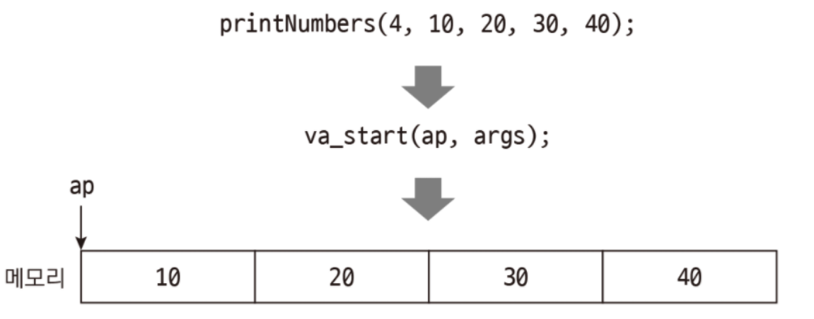

# **printf**

_요약: stdio.h의 printf 함수를 구현하는 프로젝트 입니다._

# **Contents**

- [**printf**](#printf)
- [**Contents**](#contents)
- [**Introduction**](#introduction)
- [**Key Word**](#key-word)
	- [variadic arguments](#variadic-arguments)
	- [printf()](#printf-1)
		- [서식 지정자(format specifier)](#서식-지정자format-specifier)
		- [flags](#flags)
- [**Logic**](#logic)

# **Introduction**

실제 printf의 동작을 모방한 ft_printf를 포함하는 라이브러리를 작성합니다.

서식 지정자 `cspdiuxX%` 를 구현합니다.

ar 명령어를 이용하여 라이브러리를 만들어야 합니다. libtool을 사용하는 것은 금지됩니다.

[https://github.com/42seoul-translation/subject_ko/blob/master/ft_printf/ft_printf.ko.md](https://github.com/42seoul-translation/subject_ko/blob/master/ft_printf/ft_printf.ko.md)

# **Key Word**

##  variadic arguments
_가변 인자_

------

**PROTOTYPE**

```c
#include <stdarg.h>

void	func(int num_args, ...);
```
최소 1개 이상의 고정 인수가 있어야 합니다.

`'...'`은 파라미터 순서 상 가장 마지막에 위치해 있어야 합니다.

```.c
#include <stdio.h>
#include <stdarg.h>

int	sum(int num_args, ...);

int	main()
{
	int	a = 1, b = 2, c = 3, d = 4, e = 5;
	printf("%d\n", sum(5, a, b, c, d, e));
}

int sum(int num_args, ...)
{
	va_list	ap;

	va_start(ap, num_args);
	int arg = 0, result = 0;
	for (int i = 0; i < num_args; i++)
	{
		arg = va_arg(ap, int);
		result += arg;
	}
	va_end(ap);
	return (result);
}
```

------

-	**va_list ap**
	
	_가변 변수를 가리킬 포인터_


	```c
	typedef char *va_list;
	```

	길이가 변할 수 있는 인수들을 저장하려면 가변의 저장공간이 필요합니다.

	va_list 타입이 이 가변 공간이 됩니다.

	다시말해, 가변인수들을 저장하는 스택 주소 포인터 입니다.

------

-	**va_start(ap, num_args)**

	_ap 포인터가 두번째 인자만큼 가변 변수들을 차례로 가리키게 만듭니다._

	```c
	#define va_start(ap, v) ( (ap) = (va_list)_ADDRESSOF(v) + _INTSIZEOF(v) )
	```

	va_list 인스턴스(ap)가 맨 첫 번째 가변인수를 가리킬 수 있도록 va_list를 초기화 합니다.

	첫 번째 가변인자 주소를 알려면 시작 주소값에 두 번째 인자인 고정인수를 더해주면 됩니다.

	

	va _list 주소값에다가 고정 인수 크기를 더한 위치로 ap로 초기화 합니다.

------

-	**va_arg(ap, int)**

	_읽은 정보를 반환하고 int byte만큼 포인터를 이동_

	반복문을 돌리면서 인자 값 한 개 한 개씩 뽑습니다.

	

	int 이하(char, short)의 메모리는 바이트패딩 되므로 int로 저장됩니다.

------

-	**va_end(ap)**

	_가변 인자 목록 포인터를 NULL로 초기화 합니다._


[https://dojang.io/mod/page/view.php?id=577](https://dojang.io/mod/page/view.php?id=577)

<div align = "right">
	<b><a href = "#Contents">↥ top</a></b>
</div>


------

##  printf()
_#include <stdio.h>_

------

**PROTOTYPE**

```c
int printf(const char* format, ...)
```
------

**DESCRIPTION**

C언어의 표준 출력 함수로, 여러 종류의 데이터를 다양한 서식에 맞춰 출력할 수 있게 해줍니다.

------

**RETURN VALUE**

출력되는 문자의 개수를 반환합니다.


------

**ISSUES**

### 서식 지정자(format specifier)

-	%c


	하나의 문자


-	%s

	문자열

	```c
	printf("%s", NULL) // -> (NULL) return = 6
	printf("%s", "") // ->	return = 0
	printf("%s", "\0") // -> return = 0
	```

	

-	%d, %i

	부호 있는 10진 정수

	```c
	printf("%d\n", 2147483647);
    // printf("%d\n", 2147483648); -> ld
	```

-	%u

	부호 없는 10진 정수

	```c
    unsigned int a = 4294967295; // -> 4294967295
    unsigned int b = -4294967294; // -> 2
    printf("%u\n", a);
    printf("%u\n", b);

    printf("%u\n", -1); // underflow -> 4294967295
    printf("%u\n", -2147483647); // underflow -> 2147483649
	```

-	%x

	부호 없는 16진 정수 (소문자 사용)

-	%X

	부호 없는 16진 정수 (대문자 사용)

-	%%

	퍼센트(%) 기호 출력

------

### flags

<div align = "right">
	<b><a href = "#Contents">↥ top</a></b>
</div>

# **Logic**


1. Values

	`int printed_len`

	-	ft_printf() 함수의 반환값으로, 
	-	출력된 문자의 개수를 반환합니다.
	<br><br>

	`int check_fail`

	-	`write()` 함수의 반환 값을 받으며,
	-	출력에 실패했을 때 `-1`를 확인합니다.
	<br><br>

	`va_list ap`

	-	char *형 포인터로,
	-	가변 인자의 메모리 주소를 담습니다.
	<br><br>


2.	Functions

	va_start(ap, format)을 통해 첫번째 가변 인자에 접근시킵니다.

	format의 값이 끝날 때까지 출력되어야 하므로
	
	while(*format)으로 반복문을 돌립니다.

	경우의 수는 1. 서식 지정자가 아닌 경우 / 2. 인 경우로 나뉩니다.

	서식 지정자가 아닌 경우
	
	**`ft_print_char((int)*format)`**로 문자를 출력합니다.

	서식 지정자인 경우

	**`int check_type(const char c, va_list *ap)`**

	-	서식 지정자를 확인합니다.
	-	확인된 서식 지정자에 맞는 함수를 호출합니다.
	-	잘못된 서식 지정자가 들어온 경우 -1을 리턴합니다.
	<br><br>

	서식 지정자 함수
	
	**`ft_print_char(int c)`**

	_%c_
	-	char형은 `바이트패딩`으로 인해 int로 저장됩니다.
	-	`write()` 에 실패할 경우 `-1`을 리턴합니다.
	-	문자 1개를 출력하므로 `1`을 리턴합니다.
	<br><br>

	**`ft_print_string(unsigned char *str)`**

	_%s_
	-	`str == NULL`일 경우 `(NULL)`을 출력하고 `6`을 리턴합니다.
	-	`write()` 에 실패할 경우 -1을 리턴합니다.
	-	문자열의 길이만큼 리턴합니다.
	<br><br>


	**`ft_print_integer(int num)`**

	_%d, %i_
	-	`ft_putnbr_base(num, "0123456789")`로 출력합니다.
	-	`ft_itoa(num)` 을 통해 만들어진 문자열의 길이를 구해 리턴합니다.
	-	`write()` 에 실패할 경우 -1을 리턴합니다.
	<br><br>

	**`ft_print_unsigned_integer(unsigned int num, char type)`**

	_%u_
	-	`ft_print_integer(int num)`와 동일한 방식으로 작동합니다.
	-	`ft_itoa(num)` 을 통해 만들어진 문자열의 길이를 구해 리턴합니다.
	-	`write()` 에 실패할 경우 -1을 리턴합니다.
	-	문자열의 길이만큼 리턴합니다.

	_%x, %X_
	<br><br>


	**`char *split_to_line(char **backup, char *buf)`**

	-	`line`과 `backup`을 설정합니다.
	<br><br>
