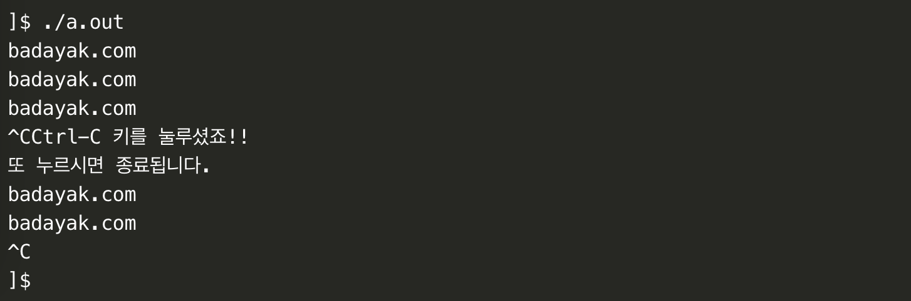

# minitalk

[](https://github.com/JaeSeoKim/badge42)

_data exchange program using UNIX signals_

- [source_code](https://github.com/ejaee/minitalk)

- [subject_pdf](https://github.com/42seoul-translation/subject_ko/blob/master/minitalk/minitalk.md)

### `signal`

```.c
#include <signal.h>

void (*)(int) signal(int sig, void (*handler)(int));
```
_첫번째 인자로 전달된 상황 발생 시, 두번째 인자 주소의 함수가 호출_

> signal(1, 2) -> 상수 1이 발생하면 함수 2를 호출시켜라

Signal이란 Software interrupt로, process에 무언가 발생했음을 알리는 간단한 메시지를 비동기적으로 보내는 것

Signal을 받은 프로세스는 Signal에 따른 미리 지정된 기본 동작을 수행할 수도 있고, 사용자 정의 함수에 의해 특별 처리가 가능

- ex) 프로세스 진행 중에 Ctrl + c를 눌러 기본처리로 프로세스를 종료
- ex) 프로세스에 kill 명령이 내려졌을 때 Signal이 발생

-  `sig`: 처리해줄 시그널 번호
   -  `SIGABRT`: 비정상 종료
   -  `SIGSEGV`: 유효하지 않은 메모리에 액세스
   -  `SIGUSR1`: 사용자 애플리케이션용입니다. (ANSI로 연장)
   -  `SIGUSR2`: 사용자 애플리케이션용입니다. (ANSI로 연장)

### `sigaction`

_signal 함수와 유사한 sigaction_

sigaction은 signal 함수를 대체할 뿐만 아니라 훨씬 안정적

- signal 함수는 유닉스 계열의 운영체제 별로 동작 방식의 차이가 있음
- sigaction 함수는 차이가 없음


```.c
#include <signal.h>

int sigaction(int sig, const struct sigaction *act, struct sigaction *oldact);
```

_성공 시 0, 실패 시 -1을 반환_

- `sig`: signal과 마찬가지로 시그널의 정보를 인자로 전달
- `act`: 첫번째 인자 시그널 발생 시 설정할 행동
- `oldact`: 이전에 시그널을 처리하던 방법을 저장할 구조체 주소로, 필요 없으면 0 전달

```.c
struct sigacgion
{
    void (*sa_handler)(int);
    // 시그널을 처리하기 위한 핸들러
    // SIG_DFL, SIG_IGN 또는 핸들러 함수

    void (*sa_sigaction)(int, siginfo_t *, void *); 
    // 밑의 sa_flags가 SA_SIGINFO일때
    // sa_handler 대신에 동작하는 핸들러

    sigset_t sa_mask;             
    // 시그널을 처리하는 동안 블록화할 시그널 집합의 마스크
    
    int sa_flags;                 
    // 아래 설명을 참고
    
    void (*sa_restorer)(void);    
    // 사용해서는 안됨
}
```

- sa_flag
  - 'SA_SIGINFO': 이 옵션이 사용되면 sa_handler대신에 sa_sigaction이 동작
  - 다양한 인수를 받을 수 있음
  - 'sa_sigaction'이 받는 인수에는 '시그널 번호', '시그널이 만들어진 이유', '시그널을 받는 프로세스의 정보'


- sa_sigaction
  - sa_handler와 sa_sigaction은 메모리가 중첩된다
  - sa_flag에 SA_SIGINFO가 설정되어 있는지 유무에 따라 두 함수가 호출된다
  - siginfo_t *의 구조체
    ```c
    <sys/siginfo.h>

    siginfo_t {
    int      si_signo;  /* 시그널 넘버 */
    int      si_errno;  /* errno 값 */
    int      si_code;   /* 시그널 코드 */
    pid_t    si_pid;    /* 프로세스 ID 보내기 */
    uid_t    si_uid;    /* 프로세스를 전송하는 실제 사용자 ID */
    int      si_status; /* Exit 값 또는 시그널 */
    clock_t  si_utime;  /* 소모된 사용자 시간 */
    clock_t  si_stime;  /* 소모된 시스템 시간 */
    sigval_t si_value;  /* 시그널 값 */
    int      si_int;    /* POSIX.1b 시그널 */
    void *   si_ptr;    /* POSIX.1b 시그널 */
    void *   si_addr;   /* 실패를 초래한 메모리 위치 */
    int      si_band;   /* 밴드 이벤트 */
    int      si_fd;     /* 파일 기술자 */
    }
    ```

예제 1)
signal()을 이용하여 Ctrl-C 를 누르면 사용자 핸들러가 실행되었다가 두 번째 Ctrl-C 키를 누르면 프로그램이 종료되는 예제

```c
#include <stdio.h>
#include <unistd.h>
#include <signal.h>

struct sigaction act_new;
struct sigaction act_old;

void sigint_handler( int signo)
{
   printf( "Ctrl-C 키를 눌루셨죠!!\n");
   printf( "또 누르시면 종료됩니다.\n");
   sigaction( SIGINT, &act_old, NULL);
}

int main( void)
{
   
   act_new.sa_handler = sigint_handler; // 시그널 핸들러 지정
   sigemptyset( &act_new.sa_mask);      // 시그널 처리 중 블록될 시그널은 없음

   // SIGINT를 지정하면서 act_old에 이전 정보를 구함
   sigaction( SIGINT, &act_new, &act_old); 
   while( 1 ){
      printf( "badayak.com\n");
      sleep( 1);
   }
}
```



### `kill`

```.c
#include <signal.h>

int kill(pid_t pid, int sig)
```

- `pid`: 시그널을 받을 프로세스의 id
- `sig`: pid로 지정된 프로세스에 보내려는 시그널

> pid > 0 인 경우 pid로 지정한 프로세스에게 시그널을 보낸다

### `pid`

process
- 실행중인 프로그램

pid
- 실행중인 프로그램의 고유 번호

### `handshake`
_핸드셰이킹(handshaking)_

주고받기는 정보기술과 전기통신 및 관련 분야에서 채널에 대한 정상적인 통신이 시작되기 전에 두 개의 실체 간에 확립된 통신 채널의 변수를 동적으로 설정하는 자동화된 협상 과정

정상적인 정보 전송 이전에 이루어진다

### `pause()`

_시그널을 수신할 때 까지 대기 함수_

```.c
#include <unistd.h>

int pause(void)
```

항상 -1을 반환

###  `unicode`

- 아스키코드
    _American Standard Code for Information Interchange_

    - 1바이트(8비트)로 구성되어 있다
    - 1 비트는 오류를 확인하는 용도로 사용된다
    - 나머지 7비트, 즉 128개의 문자를 나타낼 수 있다
    - 더 많은 부호를 표현하고자 8개의 비트를 사용하는 ANSI 코드가 나오기도 했다

전 세계의 모든 문자를 나타내기 위해

- 유니코드
    - 2바이트(16비트)로 구성되어 있다
    - 2^16인 65536개의 문자를 표현할 수 있다
    - 0x0000 ~ 0xFFFF
    - 0000 0000 0000 0000 ~ 1111 1111 1111 1111
    - 이후 17개의 영역이 각각 2^16개의 문자를 표현하는 Plane이 나오기도 했다

# Reference

- [signal](https://blockdmask.tistory.com/23)

- [sigaction](https://badayak.com/entry/C언어-시그널-처리-함수-sigaction)

- [unicode](https://code-lab1.tistory.com/233)
