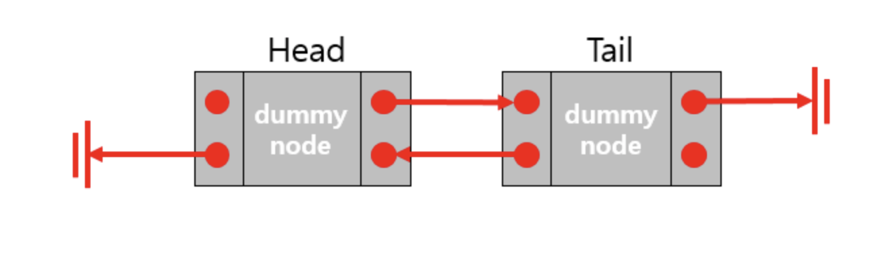
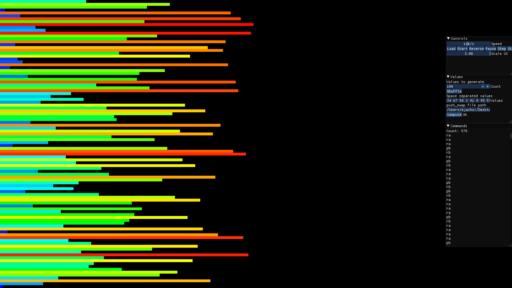
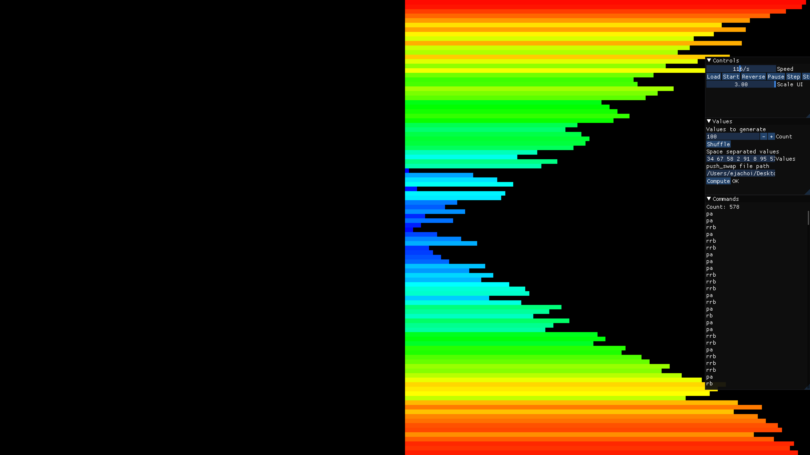
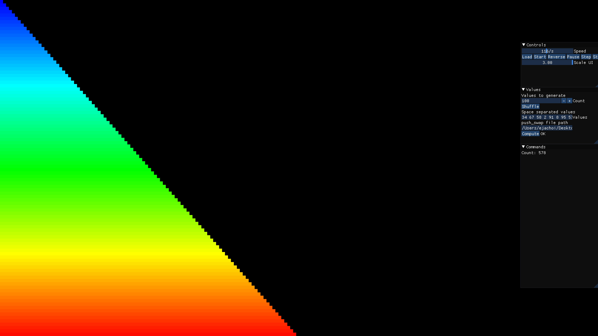
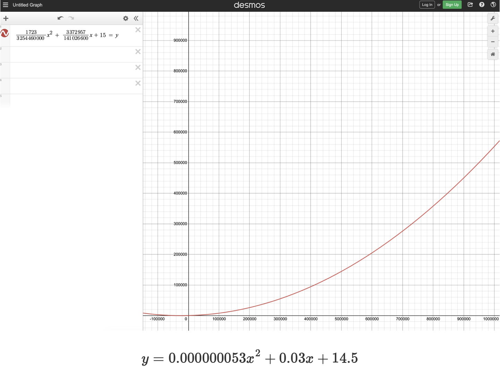
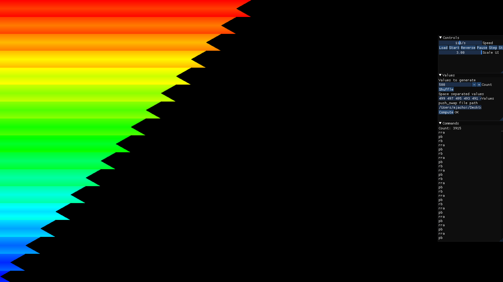
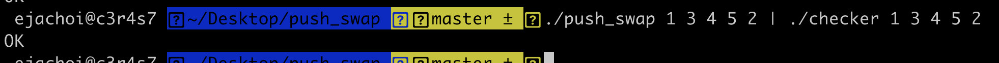

# **push_swap**

_요약: stack 두개와 몇가지 operation을 활용하여 매개변수로 들어오는 숫자를 정렬하는 프로그램을 만듭니다._

[과제pdf](https://github.com/42seoul-translation/subject_ko/blob/master/push_swap/push_swap.ko.md)

# **Introduction**

- input 값으로 stack_a에 담을 숫자를 받습니다.

- 스택에서 숫자들을 다루는 몇가지 operation이 존재합니다.

	```c
	(sa, sb, ss, pa, pb, ra, rb, rr, rra, rrb, rrr)
	```

- 두개의 stack을 활용하여 최종적으로 stack_a에 오름차순으로 정렬합니다.

# **Contents**

- [**push_swap**](#push_swap)
- [**Introduction**](#introduction)
- [**Contents**](#contents)
- [**Logic (Mandatory)**](#logic-mandatory)
	- [모래시계 알고리즘](#모래시계-알고리즘sandglass)
- [**Logic (Bonus)**](#logic-bonus)
- [**Issue**](#lssue)
- [**Study sites**](#study-site)


# **Logic (Mandatory)**

0. 자료구조

	- 더미노드 기반의 양방향 연결리스트 활용

		
		[참조](https://yeahajeong.tistory.com/180)

		`push_top`, `push_bottom`, `pop_top`, `pop_bottom`에 용이합니다

	- 구조체

		```h
		// node 구조체
		typedef struct s_node
		{
			int				data;
			int				index;	// indexing에 필요한 변수
			struct s_node	*next;
			struct s_node	*prev;
		}	t_node;

		// stack 구조체
		typedef struct s_list
		{
			t_node	*top;
			t_node	*bottom;
			t_node	*cur;
			int		num_of_data;	//stack에 저장된 data의 개수
		}	t_list;
		```


1. input 값들을 저장할 stack_a를 생성

	`stack_a_init`

	-	top, bottom 이름을 가진 dummy_node를 생성합니다
	-	이중 연결 리스트로 설정합니다

2. 타당한 매개변수인지 체크

	`validate_param`

	-	문자열로 들어올 수 있습니다

		```
		/push_swap 3 5 "2 1 "
		```

		문자열을 `ft_split`을 활용하여 각각의 숫자로 나눠줍니다

		`is_nbr`, `in_integer`, `is_duplicate` 인지 확인합니다

		문제가 되지 않는다면 stack_a에 `push_bottom` 합니다

3. sort를 위한 준비

	`stack_b_init`

	-	두번째 stack을 생성합니다

4. 최소값부터 순차적으로 indexing

	`stack_indexing`

	-	정렬에 용이하도록 낮은 숫자부터 indexing 해줍니다
		```
		/push_swap 3 5 "2 1 "

		3(2)
		5(3)
		2(1)
		1(0)
		```

5. 정렬

	`ft_sort`

	-	평가지에서 5개 이하의 인자 테스트가 있습니다

		2, 3, 4, 5 개의 인자를 받을 경우 hard coding 해줍니다

	-	이외의 인자가 들어올 경우 `모래시계 알고리즘`을 활용합니다

	## 모래시계 알고리즘(sandglass)

	_push_bottom_
	
	_stack_a_to_b_
	
	_stack_b_to_a_
	

	1. stack_a의 충분히 작은 값들을 b로 `대충` 넘깁니다

		```c
		while (stack_a)
		{
			if (small size data)
				move to stack_b
			else if (medium suze date)
				move to stack_b
				rotate stack_b
			else if (big size)
				retate stack_a
		}
		```

		`small size` : less than `idx`

		`medium size` : greater than `idx` && less than `idx + chunk`

		`chunk` : 평가지를 고려한 가장 효율적인 수
		
		> 100 15
		>
		> 500 30
		>
		> 1000 45
		>
		> 2000 65
		>
		> 5000 150


	2. stack_b의 값들을 a로 `정확하게` 넘깁니다

		```c
		while (stack_b)
		{
			if(top node index == num_of_data - 1)
				move to stack_a
			else
				retate stack_b
		}
		```
		_문제점_
		> 500 5500 의 평가지 조건에 걸리는 예외사항이 존재합니다
		>
		<details>
		<summary> 예외 케이스 확인하기</summary>

		>	499 497 495 493 491 489 487 485 483 481 479 477 475 473 471 470 472 474 476 478 480 482 484 486 488 490 492 494 496 498 469 467 465 463 461 459 457 455 453 451 449 447 445 443 441 440 442 444 446 448 450 452 454 456 458 460 462 464 466 468 439 437 435 433 431 429 427 425 423 421 419 417 415 413 411 410 412 414 416 418 420 422 424 426 428 430 432 434 436 438 409 407 405 403 401 399 397 395 393 391 389 387 385 383 381 380 382 384 386 388 390 392 394 396 398 400 402 404 406 408 379 377 375 373 371 369 367 365 363 361 359 357 355 353 351 350 352 354 356 358 360 362 364 366 368 370 372 374 376 378 349 347 345 343 341 339 337 335 333 331 329 327 325 323 321 320 322 324 326 328 330 332 334 336 338 340 342 344 346 348 319 317 315 313 311 309 307 305 303 301 299 297 295 293 291 290 292 294 296 298 300 302 304 306 308 310 312 314 316 318 289 287 285 283 281 279 277 275 273 271 269 267 265 263 261 260 262 264 266 268 270 272 274 276 278 280 282 284 286 288 259 257 255 253 251 249 247 245 243 241 239 237 235 233 231 230 232 234 236 238 240 242 244 246 248 250 252 254 256 258 229 227 225 223 221 219 217 215 213 211 209 207 205 203 201 200 202 204 206 208 210 212 214 216 218 220 222 224 226 228 199 197 195 193 191 189 187 185 183 181 179 177 175 173 171 170 172 174 176 178 180 182 184 186 188 190 192 194 196 198 169 167 165 163 161 159 157 155 153 151 149 147 145 143 141 140 142 144 146 148 150 152 154 156 158 160 162 164 166 168 139 137 135 133 131 129 127 125 123 121 119 117 115 113 111 110 112 114 116 118 120 122 124 126 128 130 132 134 136 138 109 107 105 103 101 99 97 95 93 91 89 87 85 83 81 80 82 84 86 88 90 92 94 96 98 100 102 104 106 108 79 77 75 73 71 69 67 65 63 61 59 57 55 53 51 50 52 54 56 58 60 62 64 66 68 70 72 74 76 78 49 47 45 43 41 39 37 35 33 31 29 27 25 23 21 20 22 24 26 28 30 32 34 36 38 40 42 44 46 48 19 17 15 13 11 9 7 5 3 1 0 2 4 6 8 10 12 14 16 18

		</details>

		<br><br>
		_개선_

		```c
		while (stack_b)
		{
			if(top node index == num_of_data - 1)
				move to stack_a
			else
			{
				if (top node index < num_of_data / 2 )
					retate stack_b
				else if (top node index > num_of_data / 2 )
					reverse retate stack_b
			}
		}
		```
		_count : 3915 로 최적화_
	

<div align = "right">
	<b><a href = "#Contents">↥ top</a></b>
</div>

# **Logic (Bonus)**

-	해당 과제에서 checker_Mac을 제공합니다.
-	checker_Mac을 통해 operation을 input 값으로 입력할 수 있습니다.
-	이후 input이 끝났다면 control + D를 통해 최종 정렬 유무를 확인할 수 있습니다.

	```sh
	./push_swap $ARG | ./checker $ARG

	# ARG가 checker의 main()에 인자로 들어가고 push_swap의 결과물, pa나 sa 등이 출력된 결과가 파이프를 넘어서(?) STDIN으로 들어간다
	```
	
-	Bonus 과제는 `checker를 직접 구현`합니다.

_Mandatory와 동일한 부분_

1. input 값들을 저장할 stack_a를 생성
2. 타당한 매개변수인지 체크
3. sort를 위한 준비
4. 최소값부터 순차적으로 indexing

_Bonus_

5. get_next_line 함수를 통해 인풋값을 전달

	`ft_check_op`

	```c
	char	*op;

	while (1)
	{
		op = get_next_line(STDIN_FILENO);
		if (!op)	// control + D
			break ;
		operation(op, stack_a, stack_b);
		free(op);
	}
	```
	> control + C : 강제 종료

6. input 값을 모두 적용한 후 정렬 유무를 확인

	```c
	if (already_sorted(t_list *stack))
		ft_putstr("OK\n");
	else
		ft_putstr("KO\n");
	```

<div align = "right">
	<b><a href = "#Contents">↥ top</a></b>
</div>

# **Issue**

free

	exit(1) 경우 OS에서 동적할당을 해제 하므로 `free`할 필요 없습니다


<div align = "right">
	<b><a href = "#Contents">↥ top</a></b>
</div>


------

# **Study sites**

<div align = "right">
	<b><a href = "#Contents">↥ top</a></b>
</div>
