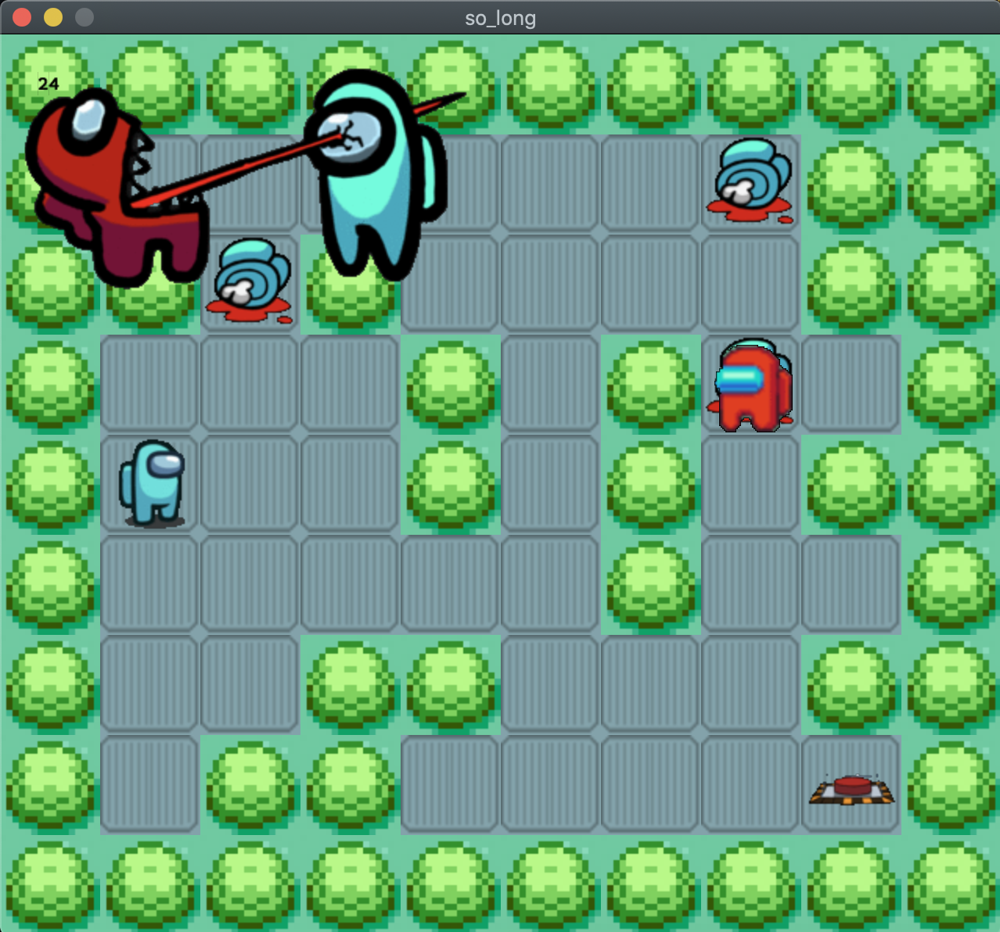

# **so_long**

<center></center>

_요약: MinilibX 라이브러리를 활용해 간단한 2D 게임을 만듭니다._

[과제pdf](https://github.com/42seoul-translation/subject_ko/blob/master/so_long/so_long_ko.md)

# **Contents**

## Goals
This project is a very small 2D game. It is built to make you work with textures, sprites. And some very basic gameplay elements.

### Install
```bash
$ make bonus
```

### Usage
```bash
$ ./so_long_bonus maps/map0.ber
```
Only map files with extension `.ber` are available. Map file examples are available in the `map/` directory.

Run the code to use all the features of the game.

### HOW TO PLAY
The player’s goal is to collect all collectibles present on the map then escape with minimal movement.

|KEYBOARD|ACTION|
|---|---|
|`W`, `↑`|Move up|
|`S`, `↓`|Move down|
|`A`, `←`|Move left|
|`D`, `→`|Move right|
|`R`| Start game|
|`ESC`|Close the game window|

# **MinilibX**

_스크린에 무언가 렌더링 할 수 있게 해주는 작은 그래픽 라이브러리_

### `mlx_init` - 초기화

- mlx_init() 함수는 void\* 형의 mlx 구조체 주소를 반환한다

  ```.c
  #include <mlx.h>

  int main(void)
  {
  	void *mlx_ptr;

  	mlx_ptr = mlx_init();
  	return (0);
  }
  ```

### `mlx_new_window` - 화면 띄우기

- mlx_new_window를 통해 화면을 띄운다
- mlx_loop를 통해 loop를 돌면서 event를 기다리고, 생성한 윈도우를 Rendering 한다

_Rendering은 3차원 공간에 객체를 2차원 화면인 하나의 장면으로 표현하는 것을 말한다_

### `mlx_loop` - 화면 유지하기

	```.c
	#include <mlx.h>
	
	int main()
	
	{
		void *mlx_ptr;
		void *win_ptr; // 생성할 윈도우를 가리키는 포인터
	
		mlx_ptr = mlx_init();
		win_ptr = mlx_new_window(mlx_ptr, 500, 500, "Hellow World!");
		mlx_loop(mlx_ptr);
		return (0);
	}
	
	```

	> cc -L./mlx -lmlx -framework OpenGL -framework AppKit main.c

### `mlx_hook` - 이벤트를 실행시킬 키 값 받기

- x_event에 X11 events라고 mlx에 등록된 이벤트의 번호다
- 번호에 대응되는 이벤트를 후킹한다.
	- x11 events:
	- 02: KeyPress
	- 03: KeyRelease
	- 04: ButtonPress
	- 05: ButtonRelease

### `mlx_loop_hook` - 키 값을 입력받지 않는동안 발생하는 이벤트 관리

- 이미지는 이벤트와 무관하게 게속 보여야 하므로 해당 함수를 활용


### `mlx_loop`- 창을 지속적으로 띄우기

	```.c
	#include <mlx.h>
	
	int main()
	
	{
		t_game	game;
	
		void *mlx_ptr;
		void *win_ptr; // 생성할 윈도우를 가리키는 포인터
	
		mlx_ptr = mlx_init();
		win_ptr = mlx_new_window(mlx_ptr, 500, 500, "so_long");
		mlx_hook(game.win_ptr, X_EVENT_KEY_PRESS, 0, press_key, &game);
		mlx_hook(game.win_ptr, X_EVENT_KEY_EXIT, 0, close_game, &game);
		mlx_loop_hook(mlx_ptr, &put_img, &game);
		mlx_loop(mlx_ptr);
		return (0);
	}
	
	```
