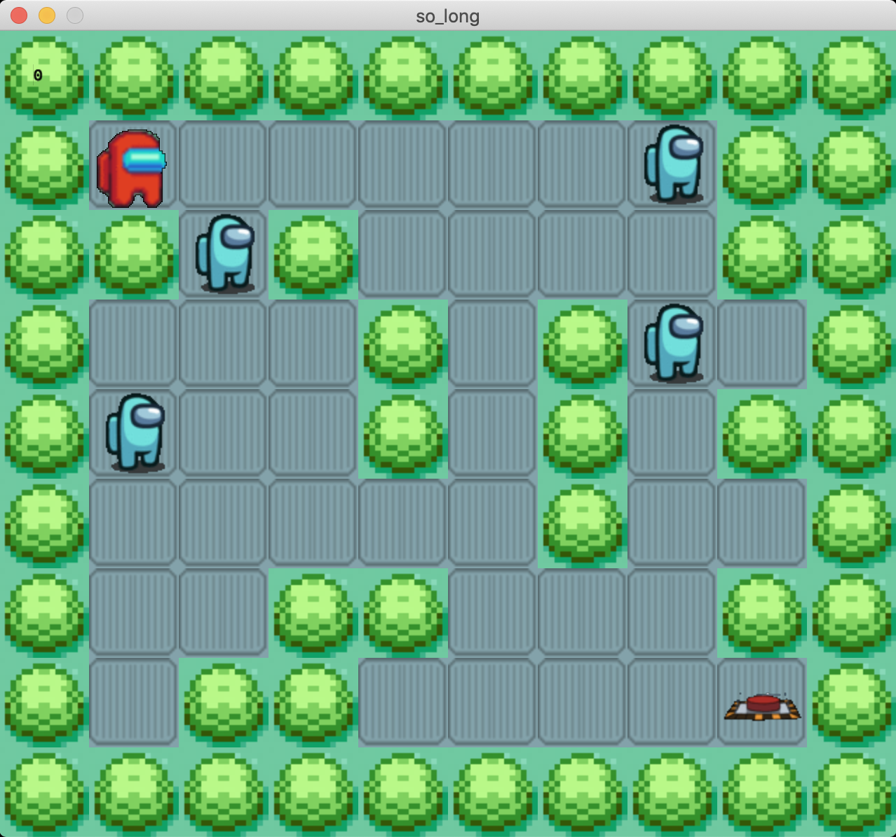

# **so_long**



_요약: MinilibX 라이브러리를 활용해 간단한 2D 게임을 만듭니다._

[과제pdf](https://github.com/42seoul-translation/subject_ko/blob/master/so_long/so_long_ko.md)

# **Introduction**

- 첫 번째 인자로 .ber 확장자의 파일을 받습니다.

- 파일의 맵이 유효한지 확인합니다.

- 주인공이 특정 수집품을 모은 뒤 공간을 떠나는 방식의 2D 게임 프로그램을 만듭니다.

# **Contents**

# **MinilibX**

_스크린에 무언가 렌더링 할 수 있게 해주는 작은 그래픽 라이브러리_

mlx_init - 초기화

- mlx_init() 함수는 void\* 형의 mlx 구조체 주소를 반환한다

  ```.c
  #include <mlx.h>

  int main(void)
  {
  	void *mlx_ptr;

  	mlx_ptr = mlx_init();
  	return (0);
  }
  ```

mlx_new_window - 화면 띄우기

- mlx_new_window를 통해 화면을 띄운다
- mlx_loop를 통해 loop를 돌면서 event를 기다리고, 생성한 윈도우를 Rendering 한다

_Rendering은 3차원 공간에 객체를 2차원 화면인 하나의 장면으로 표현하는 것을 말한다_

```.c
#include <mlx.h>

int main()

{
	void *mlx_ptr;
	void *win_ptr; // 생성할 윈도우를 가리키는 포인터

	mlx_ptr = mlx_init();
	win_ptr = mlx_new_window(mlx_ptr, 500, 500, "Hellow World!");
	mlx_loop(mlx_ptr);
	return (0);
}

```

> cc -L./mlx -lmlx -framework OpenGL -framework AppKit main.c

# **Logic (Mandatory)**

```

```

기능 구현 목록

1. 인자 하나 받기 (map.ber)

2. 인자 유효성 체크

   - 인자가 하나인가
   - .ber 확장자

3. 맵 유효성 체크

   - row col이 최소한의 사이즈를 가지고 있는가
   - 캐릭터, 탈출구, 벽이 존재하는가
   - 테두리가 유효한가
   - 캐릭터 , 먹이, 탈출구가 벽으로 둘러 쌓여있지 않은가
   -

4. 객체 초기화

   - mlx_xpm_file_to_image 를 이용하여 저장하기

```
cc -L./mlx -lmlx -framework OpenGL -framework AppKit main3.c Libft/libft.a gnl/gnl.c
```
